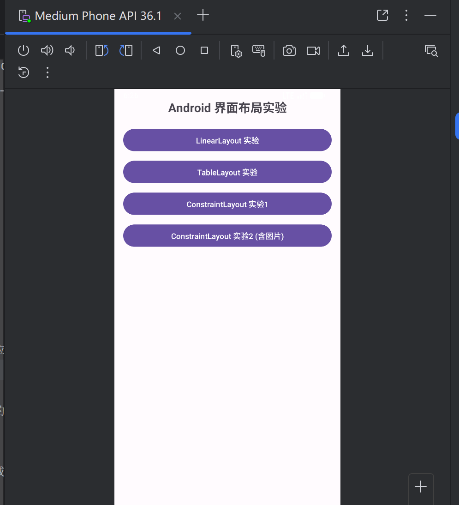
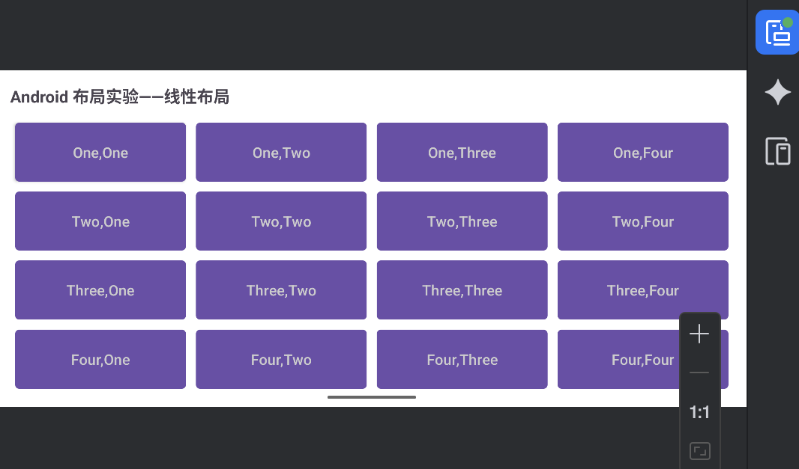
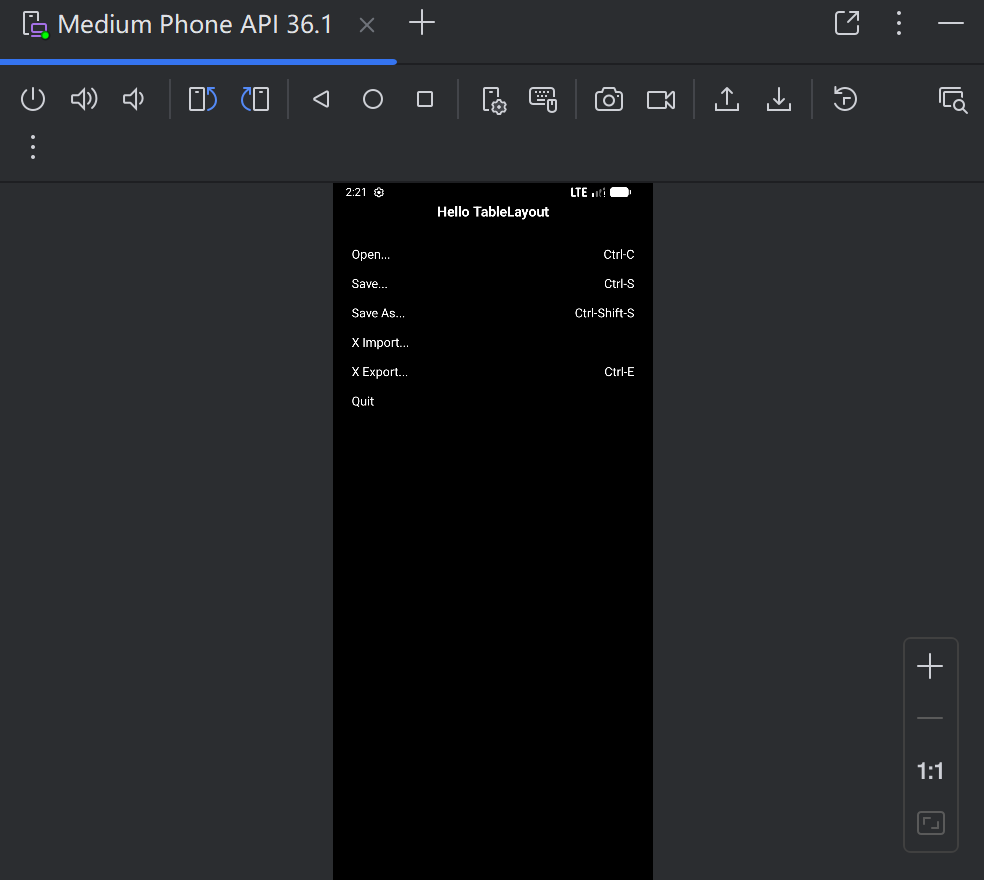
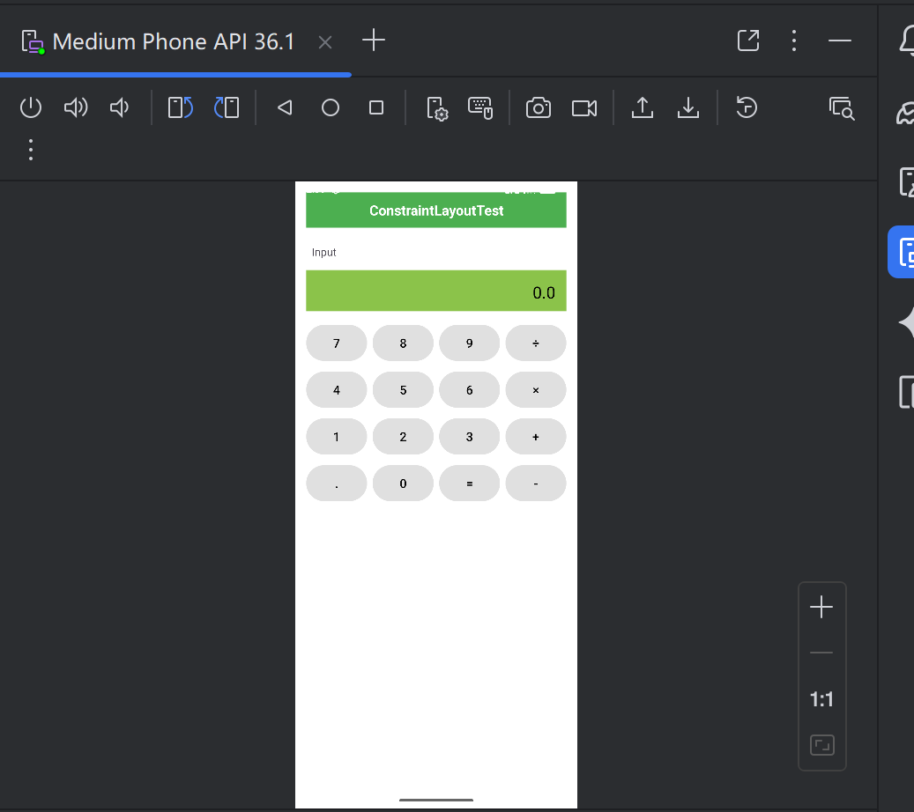
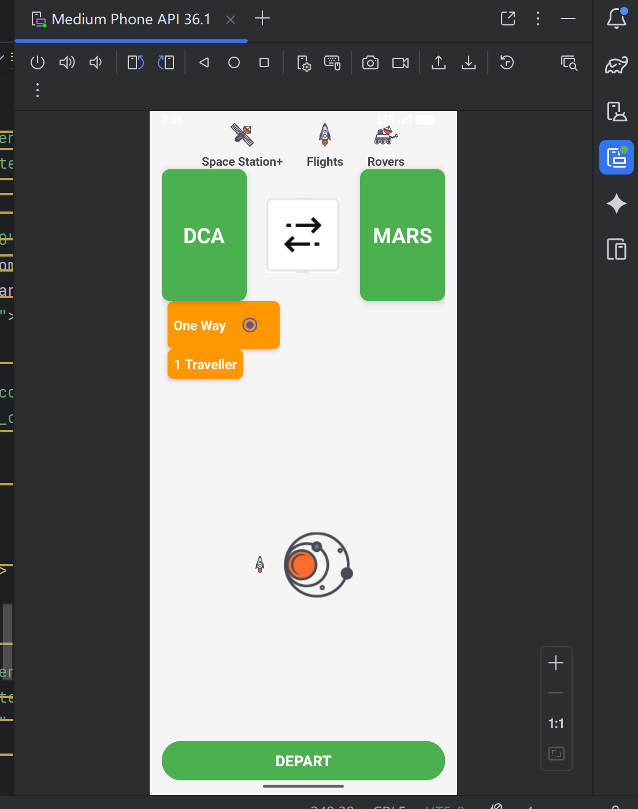

实验报告
课程   移动软件应用开发     实验名称    Android界面布局实验
专业___软件工程____________班级___2班 ______  学号__121052023072___  姓名 李承焕
实验日期：  2025  年  10 月  8 日
一、实验目的
完成线性布局，表格布局，约束性布局

二、实验内容
完成线性布局，表格布局，约束性布局

三、实验环境
Android studio

四、实验步骤
（1）设计好主界面：
主界面中包含四个实验的按钮，点击之后跳转到相应的实验界面：

（2）相应的设计一个个实验
线性：

表格：

约束性实验1：

约束性实验2：

五、总结
实验整体是成功的
遇到的问题及解决办法：
约束布局警告：部分视图缺少垂直约束，通过添加完整的约束链解决

布局适配问题：需要根据实验需求设计相应的布局，在过程中经常出现错误

图片资源管理：建立规范的图片命名和目录结构，优化加载性能

主要收获：熟练掌握了ConstraintLayout的复杂布局实现，了解了布局设计的具体过程和步骤。

